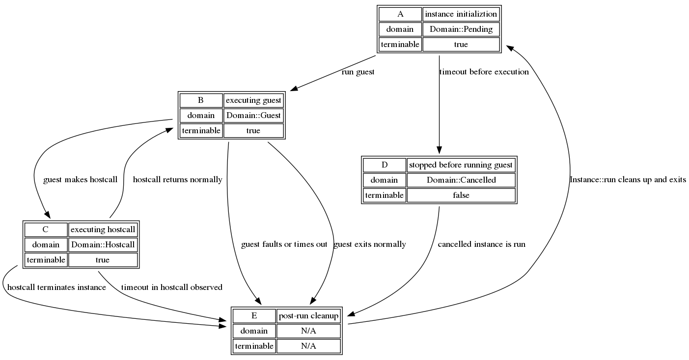

# `KillSwitch`

`KillSwitch` is a mechanism by which users of `lucet-runtime` can
asynchronously request, very sternly, that an `lucet_runtime::Instance` be
disabled from running.

If the instance is currently running, it will be stopped as soon as possible.
If the instance has not yet started running, it will immediately exit with
an error when the `lucet` embedder attempts to run it.

`KillSwitch` easily interoperates with Lucet's instance suspend/resume
machinery: suspending an instance is, from the instance's point of view, just a
(possibly very long) hostcall. Termination of a suspended instance behaves like
termination in any other hostcall: witnessed when the instance is resumed and
the "hostcall" exits.

In some circumstances, a `KillSwitch` may successfully fire to no actual effect
at any point in the program - one such example is termination in a hostcall that
eventually faults; since termination cannot preempt hostcalls, the termination may
never be witnessed if the fault causes the host to never resume the Lucet
instance.

In this chapter we will describe a typical usage of `KillSwitch` as a mechanism
to enforce execution time limits. Then, we will discuss the implementation
complexities that `KillSwitch` must address to be correct.

`KillSwitch` are valid for termination only on the instance call after they are
created, or until an instance is reset. When a call into a guest returns, the
shared state by which `KillSwitch` signal is replaced, and an attempt to
`terminate` will fail with an `Err`.

## Example: `KillSwitch` used as a timeout mechanism

This example is taken from `lucet_runtime_tests::timeout::timeout_in_guest`:

```rust
let module = mock_timeout_module();
let region = <TestRegion as RegionCreate>::create(1, &Limits::default())
    .expect("region can be created");
let mut inst = region
    .new_instance(module)
    .expect("instance can be created");
let kill_switch = inst.kill_switch();

// Spawn a thread to terminate the instance after waiting for 100ms.
let t = thread::Builder::new()
    .name("killswitch".to_owned())
    .spawn(move || {
        thread::sleep(Duration::from_millis(100));
        assert_eq!(kill_switch.terminate(), Ok(KillSuccess::Signalled));
    })
    .expect("can spawn a thread");

// Begin running the instance, which will be terminated remotely by the KillSwitch.
match inst.run("infinite_loop", &[]) {
    Err(Error::RuntimeTerminated(TerminationDetails::Remote)) => {
        // the result of a guest that was remotely terminated (a KillSwitch at work)
    }
    res => panic!("unexpected result: {:?}", res),
}

// wait for the KillSwitch-firing thread to complete
t.join().unwrap();
```

## Implementation

As this section discusses implementation details of `lucet_runtime`, it will
refer to structures and enums that are unexported. For most components of
Lucet's `KillSwitch` functionality, defintions live in
`lucet-runtime-internals/src/instance/execution.rs`.

`KillState` and `Domain`, around which most of the implementation is centered,
are both defined here and are internal to Lucet. As a result, fully qualified
paths such as `instance::execution::Domain` may be used below and not have
corresponding entries visible in rustdoc - these items exist in the crate
source though!

As much as is possible, `KillSwitch` tries to be self-contained; no members are
public, and it tries to avoid leaking details of its state-keeping into public
interfaces. Currently, `lucet-runtime` is heavily dependent on POSIX
thread-directed signals to implement guest termination. For non-POSIX platforms
alternate implementations may be plausible, but need careful consideration of
the race conditions that can arise from other platform-specific functionality.

`KillSwitch` fundamentally relies on two pieces of state for safe operation,
which are encapsulated in a `KillState` held by the `Instance` it terminates:
* `execution_domain`, a `Domain` that describes the kind of execution that is
  currently happening in the `Instance`.
  - This is kept in a `Mutex` since in many cases it will need to be accessed
    either by a `KillSwitch` or `KillState`, both of which must block other
    users while they are considering the domain.
* `terminable`, an `AtomicBool` that indicates if the `Instance` may stop
  executing.
  - `terminable` is in some ways a subset of the information expressed by
    `Domain`. It is true if and only if the instance is not obligated to a
    specific exit mechanism yet, which could be determined by examing the
    active `Domain` at points we check `terminable` instead. Even though this
    is duplicative, it is necessary for a correct implementation when POSIX
    signal handlers are involved, because it is extremely inadvisable to take
    locks in a signal handler. While a `Mutex` can be dangerous, we can share
    an `AtomicBool` in signal-safety-constrained code with impunity! See the
    section `Timeout while handling a guest fault` for more details on working
    under this constraint.

The astute observer may notice that `Lucet` contains both an instance `Domain`
and an instance `State`. These discuss different aspects of the instance's
lifecycle: `Domain` describes what the instance is doing right now, where
`State` describes the state of the instance as visible outside `lucet_runtime`.
This is fundamentally the reason why `State` does not and cannot describe a
"making a hostcall" variant - this is not something `lucet_runtime` wants to
expose, and at the moment we don't intend to make any commitments about being
able to query instance-internal state like this.

Additionally, this is why `Domain::Terminated` only expresses that an instance
has _stopped_ running, not if it successfully or unsuccessfully exited. From
`Domain`'s perspective, the instance has stopped running, and that's all there
is to it. The `Instance`'s `State` will describe how the instance stopped, and
if that's by a return or a fault.

### Termination Mechanisms

At a high level,`KillSwitch` picks one of several mechanisms to terminate an
instance. The mechanism selected depends on the instance's current `Domain`:

`Domain::Guest` is likely to be the most common termination form.
`lucet_runtime` will send a thread-directed `SIGARLM` to the thread running the
Lucet instance that currently is in guest code.

`Domain::Hostcall` results in the mechanism with least guarantees:
`lucet_runtime` can't know if it's safe to signal in arbitrary host-provided
code[1]. Instead, we set the execution domain to `Domain::Terminated` and wait
for the host code to complete, at which point `lucet_runtime` will exit the
guest.

`Domain::Pending` is the easiest domain to stop execution in: we simply update
the execution domain to `Cancelled`. In `enter_guest_region`, we see that the
instance is no longer eligible to run and exit before handing control to the
guest.

Other variants of `Domain` imply an instance state where there is no possible
termination mechanism. `Domain::Terminated` indicates that the instance has
already been terminated, and `Domain::Cancelled` indicates that the instance
has already been preemptively stopped.

#### Guest Signalling

There are two other pieces of information attached to `KillState` that support
the specific case where we need to send a `SIGALRM`: the thread ID we need to
signal, and a [`Condvar`][condvar] we can wait on to know when the instance has
been stopped.

The thread ID is necessary because we don't record _where_ the instance is
running anywhere else. We keep it here because, so far, `KillState` is the only
place we actually need to care. `Condvar` allows `lucet_runtime` to avoid a
spin loop while waiting for signal handling machinery to actually terminate an
`Instance` in `Domain::Guest`.

### Lifecycle

Having described both `KillState` and the termination mechanisms it helps
select, we can discuss the actual lifecycle of the `KillState` for a call into
an `Instance` and see how these pieces begin to fit together.

Because `KillState` only describes one call into an instance, an `Instance` may
have many `KillState` over its lifetime. Even so, at one _specific_ time there
is only one `KillState`, which describes the current, or imminent, call into
the instance.

Execution of a Lucet `Instance` begins with a default `KillState`: in the
`Pending` domain, `terminable` set to `true`, with no `thread_id` as it is not
currently running.  When a call is made to `Instance::run`, the `Instance`'s
bootstrap context is set up and `KillState::schedule` is called to set up
last-minute state before the instance begins running.

`lucet_runtime` shortly thereafter will switch to the `Instance` and begin
executing its bootstrapping code. In `enter_guest_region` the guest will lock
and update the execution domain to `Guest`, or see the instance is
`Domain::Cancelled` and exit. If the instance could run, we proceed into the
AOT-compiled Wasm.

At some point, the instance will likely make a hostcall to embedder-provided or
`lucet_runtime`-provided code; correctly-implemented hostcalls are wrapped in
`begin_hostcall` and `end_hostcall` to take care of runtime bookkeeping,
including updating `execution_domain` to `Domain::Hostcall` (`begin_hostcall`)
and afterwards checking that the instance can return to guest code, setting
`execution_domain` back to `Domain::Guest` (`end_hostcall`).

At some point the instance will hopefully exit, where in
`lucet_context_backstop` we check that the instance may stop exiting
(`KillState::terminable`). If it can exit, then do so. Finally, back in
`lucet_runtime`, we can `KillState::deschedule` to tear down the last of the
run-specific state - the `thread_id`.

## Implementation Complexities (When You Have A Scheduler Full Of Demons)

Many devils live in the details. The rest of this chapter will discuss the
numerous edge cases and implementation concerns that Lucet's asynchronous
signal implementation must consider, and arguments for its correctness in the
face of these.

First, a flow chart of the various states and their transitions:


This graph describes the various states that reflect values of
`execution_domain` and `terminable` for those states, with edges describing
transitions between domains including termination in non-race scenarios. The
rest of this section discusses the correctness of termination at boundaries
where these state transitions occur.

For reference later, the possible state transitions are:
* `A -> B` (instance runs guest code)
* `A -> D` (KillSwitch fires before instance runs)
* `B -> C` (guest makes a hostcall)
* `B -> E` (normal guest exit)
* `B -> E` (from a guest fault/termination)
* `C -> B` (hostcall returns to guest)
* `C -> E` (hostcall terminates instance)
* `C -> E` (hostcall observes termination)
  - not an internal state but we will also discuss termination during a hostcall fault
* `D -> E` (cancelled guest is run)

These will be covered in rough order of complexity, starting with the simplest
cases and ending with the race which has shown itself to have the most corners.
Races involving `Domain::Guest` tend to be trickiest, and consequently are
further down.

### `A -> D` - Termination before instance runs

This is a timeout while another `KillSwitch` has already fired, timing out a
guest before exeuction. Because another `KillSwitch` must have fired for there
to be a race, one of the two will acquire `terminable` and actually update
`execution_domain`, while the other simply exits.

### `D -> E` - Termination when cancelled guest is run

Terminating a previously cancelled guest will have no effect - termination must
have occurred already, so the `KillSwitch` that fired will not acquire
`terminable`, and will return without ceremony.

### `C -> B` - Termination when hostcall returns to guest

The case of a `KillSwitch` firing while exiting from a hostcall is very similar
to termination while entering a hostcall.

The `KillSwitch` might observe a guest in `Domain::Guest`, prohibit a state
change, and signal the guest. Alternatively, the `KillSwitch` can observe the
guest in `Domain::Hostcall` and update the guest to `Domain::Terminated`. In
the latter case, the guest will be free to run when the `KillSwitch` returns,
at which point it will have the same behavior as termination in any
hostcall.

### `C -> E` - Termination during hostcall terminating instance

The `KillSwitch` that fires acquires `terminable` and then attempts to acquire
a lock on `execution_domain`. The `KillSwitch` will see `Domain::Hostcall`, and
will update to `Domain::Terminated`. The shared `KillState` will be not used by
`lucet_runtime` again in the future, because after returning to the host it
will be replaced by a new `KillState`.

### `C -> E` - Termination repeatedly during hostcall

Termination while a hostcall is already observing an earlier termination will
have no effect. The `KillSwitch` that fired last will not acquire
`terminable`, and will return without ceremony.

### `B -> C` - Termination when guest makes a hostcall

If a `KillSwitch` fires during a transition from guest (B) to hostcall (C) code,
there are two circumstances also contingent on whether the instance has
switched to `Domain::Hostcall`.

#### Before switching to `Domain::Hostcall`

The `KillSwitch` that fires locks `execution_domain` and sees the execution
domain is `Domain::Guest`. It then uses typical guest termination macinery and
signals the guest. An important correctness subtlety here is that `KillSwitch`
holds the `execution_domain` lock until the guest is terminated, so the guest
cannot simultaneously proceed into hostcall code and receieve a stray
`SIGALRM`.

#### After switching to `Domain::Hostcall`

The `KillSwitch` that fires acquires `terminable` and then attempts to acquire
a lock on `execution_domain`. Because the instance is switching to or has
switched to `Domain::Hostcall`, the `KillSwitch` will select the termination
style for hostcalls. It will update the execution domain to
`Domain::Terminated` and the instance will return when the hostcall exits and
the `Terminated` domain is observed.

### `A -> B` - Termination while entering guest code

If a `KillSwitch` fires between instance initialization (A) and the start of
guest execution (B), there are two circumstances to consider: does the
termination occur before or after the Lucet instance has switched to
`Domain::Guest`?

#### Before switching to `Domain::Guest`

The `KillSwitch` that fires acquires `terminable` and then locks
`execution_domain` to determine the appropriate termination  mechanism.  This is
before the instance has locked it in `enter_guest_region`, so it will acquire
the lock, with a state of `Domain::Pending`. Seeing a pending instance, the
`KillSwitch` will update it to `Domain::Cancelled` and release the lock, at
which point the instance will acquire the lock, observe the instance is
`Cancelled`, and return to the host without executing any guest code.

#### After switching to `Domain::Guest`

The `KillSwitch` that fires acquires `terminable` and then attempts to acquire
a lock on `execution_domain` to determine the appropriate termination mechanism.
Because the instance has already locked `execution_domain` to update it to
`Domain::Guest`, this blocks until the instance releases the lock (and guest
code is running).  At this point, the instance is running guest code and it is
safe for the `KillSwitch` to operate as if it were terminating any other guest
code - with the same machinery as an instance in state `B` (a `SIGALRM`).

### `B -> E` - Termination during normal guest exit

The `KillSwitch` that fires attempts to acquire `terminable`, but is in a race
with the teardown in `lucet_context_backstop`. Both functions attempt to swap
`false` into `terminable`, but only one will see `true` out of it. This acts as
an indicator for which function may continue, where the other may have to take
special care as to not leave the instance in a state that would be dangerous to
signal.

#### Guest acquires `terminable`

The guest exits in the next handful of instructions. The `KillSwitch` that
failed to acquire the `true` in `terminable` exits with an indication that it
could not terminate the guest. In this circunstance, we are certain that there
is a non-conditional and short path out of the guest comprising a return from
`exit_guest_region` and a context swap back to the host code. Timeouts
"failing" due to this are only failing because the guest is about to exit, and
a signal would have no interesting additional benefit.

#### `KillSwitch` acquires `terminable`

In a more unfortunate circumstance, the `KillSwitch` is what observed the
`true` out of `terminable`. In this case, the guest observed `false` and must
not proceed, so that whenever an imminent `SIGALRM` from the corresponding
`KillSwitch` arrives, it will be in a guaranteed-to-be-safe spin loop, or on
its way there with only signal-safe state.

The `KillSwitch` itself will signal the guest as any other `Domain::Guest`
interruption.

### `B -> E` - Termination during guest fault, or terminated twice

In this sub-section we assume that the Lucet signal handler is being used, and
will discuss the properties `KillSwitch` requires from any signal handler for
correctness.

The `KillSwitch` that fires attempts to acquire `terminable`. Because a guest
fault or termination has occurred, the guest is actually in
`lucet_runtime_internals::instance::signals::handle_signal`. If termination
occurs while the guest is already responding to a previous `KillSwitch`'s
termination, the second `KillSwitch` will see `terminable` of `false` and
quickly exit.  Otherwise, `terminable` is `true` and we have to handle...

#### Terminated while handling a guest fault

In the case that a `KillSwitch` fires during a guest fault, the `KillSwitch` may
acquire `terminable`. POSIX signal handlers are highly constrained, see `man 7
signal-safety` for details. The functional constraint imposed on signal
handlers used with Lucet is that they may not lock on `KillState`'s
`execution_domain`.

As a consequence, a `KillSwitch` may fire during the handling of a guest fault.
`sigaction` must mask `SIGALRM` so that a signal fired before the handler exits
does not preempt the handler. If the signal behavior is to continue without
effect, leave termination in place and continue to the guest. A pending SIGALRM
will be raised at this point and the instance will exit. Otherwise, the signal
handler has determined it must return to the host, and must be sensitive to a
possible in-flight `KillSwitch`...

#### Instance-stopping guest fault with concurrent `KillSwitch`

In this case we must consider three constraints:
* A `KillSwitch` may fire and deliver a `SIGALRM` at any point
* A `SIGALRM` may already have been fired, pending on the handler returning
* The signal handler must return to host code

First, we handle the risk of a `KillSwitch` firing: disable termination. If we
acquire `terminable`, we know this is to the exclusion of any `KillSwitch`, and
are safe to return. Otherwise, some `KillSwitch` has terminated, or is in the
process of terminating, this guest's execution. This means a `SIGALRM` may be
pending or imminent!

A slightly simpler model is to consider that a `SIGALRM` may arrive in the
future. This way, for correctness we only have to make sure we handle the
signal we can be sent! We know that we must return to the host, and the guest
fault that occurred is certainly more interesting than the guest termination,
so we would like to preserve that information. There is no information or
effect we want from the signal, so silence the alarm on `KillState`. This way,
if we recieve the possible `SIGARLM`, we know to ignore it.

An important question to ask is "How do we know the possible `SIGARLM` must be
ignored? Could it not be for another instance later on that thread?" The answer
is, in short, "We ensure it cannot!"

The `SIGARLM` is thread-directed, so to be an alarm for some other reason,
another instance would have to run and be terminated. To prevent this, we must
prevent another instance from running. Additionally, if a `SIGALRM` is _in
flight_, we need to stop and wait anyway. Since `KillSwitch` maintains a lock
on `execution_domain` as long as it's attempting to terminate a guest, we can
achieve both of these goals by taking, and immediately dropping, a lock on
`execution_domain` before descheduling an instance.

Even taking this lock is interesting:
0. This lock could be taken while racing a `KillSwitch`, after it has observed it may fire but before advancing to take this lock.
1. This lock could be taken while racing a `KillSwitch`, after it has taken this lock.
2. This lock could be taken without racing a `KillSwitch`.

In the first case, we've won a race on `execution_domain`, but there might be a
`KillSwitch` we're blocking with this. Disarm the `KillSwitch` by updating the
domain to `Terminated`, which reflects the fact that this instance has exited.

In the second case, descheduling until the `KillSwitch` has completed
termination. The domain will be `Terminated`, and updating to `Terminated` has
no effect. We simply use this lock to prevent continuting into the host until
an in-flight `KillSwitch` completes.

In the third case, we're not racing a `KillSwitch`, and any method of exiting
the guest will have disabled termination. No `KillSwitch` will observe a
changed `execution_domain`, so it's not incorrect to update it to `Terminated`.

Taken together, this ensures that descheduling an instance serializes in-flight
`KillSwitch` or prevents one from taking effect in a possibly-incorrect way, so
we know this race is handled correctly.

### Terminated in hostcall fault

As promised, a note about what happens when a timeout occurs directly when a
hostcall faults! The instance's `execution_domain` must be `Domain::Hostcall`,
as it's a hostcall that faulted. The `KillSwitch` may or may not fire before
the signal handler disables termination. Even if it does fire, it will lock the
shared `execution_domain` and see `Domain::Hostcall`, where the domain will be
updated to `Domain::Terminated`.  Since the hostcall will not resume,
`end_hostcall` will never see that the instance should stop, and no further
effect will be had; regardless of `KillSwitch` effect, the instance will exit
through the signal handler with a `Faulted` state. Additionally, because
faulted instances cannot be resumed, `end_hostcall` will never witness the
timeout.

[1]: For example, the code we would _like_ to interrupt may hold locks, which we
can't necessarily guarantee drop. In a non-locking example, the host code could
be resizing a `Vec` shared outside that function, where interrupting the resize
could yield various forms of broken behavior.

[condvar]: https://doc.rust-lang.org/1.40.0/std/sync/struct.Condvar.html
