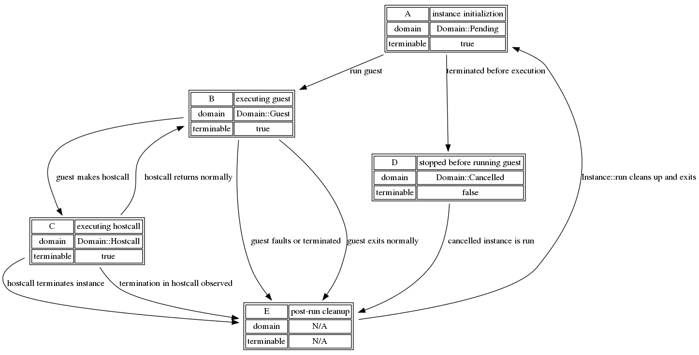

# `KillSwitch`

`KillSwitch` is a mechanism by which users of `lucet-runtime` can
asynchronously request, very sternly, that an instance be disabled from
running. If the instance is currently running, it will be stopped as soon as
possible, and if the instance has not yet run, it will immediately exit with
error when the `lucet` embedder attempts to run it. In some circumstances,
however, a `KillSwitch` may successfully fire to no actual effect at any point
in the program - one such example is a timeout in a hostcall that eventually
faults; since timeouts cannot preempt hostcalls, the timeout may never be
witnessed if the fault causes the host to never resume the Lucet instance.

In this chapter we will describe both a typical usage of `KillSwitch` as a
mechanism to enforce execution time limits, and the implementation complexities
underlying `KillSwitch` correctness.

`KillSwitch` are valid for termination only on the instance call after they are
created, and until an instance is reset. When a call into a guest returns, the
shared state by which `KillSwitch` signal is replaced, and an attempt to
`terminate` will fail with an `Err`.

## Example

This example taken from `lucet_runtime_tests::timeout::timeout_in_guest`:
```rust
let module = mock_timeout_module();
let region = TestRegion::create(1, &Limits::default()).expect("region can be created");
let mut inst = region
    .new_instance(module)
    .expect("instance can be created");
let kill_switch = inst.kill_switch();

// Spawn a thread to terminate the instance after waiting for 100ms.
let t = thread::Builder::new()
    .name("killswitch".to_owned())
    .spawn(move || {
        thread::sleep(Duration::from_millis(100));
        assert_eq!(kill_switch.terminate(), Ok(KillSuccess::Signalled));
    })
    .expect("can spawn a thread");

// Begin running the instance, which will be terminated remotely by the KillSwitch.
match inst.run("infinite_loop", &[]) {
    Err(Error::RuntimeTerminated(TerminationDetails::Remote)) => {
        // the result of a guest that was remotely terminated (a KillSwitch at work)
    }
    res => panic!("unexpected result: {:?}", res),
}

// wait for the KillSwitch-firing thread to complete
t.join().unwrap();
```

## Implementation

As this section discusses implementation details of `lucet-runtime`, it
will refer to structures and enums that are unexported.  Since there are
no `lucet-runtime` paths for these items, this section will occasionally
use fully-qualified paths to the `lucet_runtime_internals` path where.
they are originally defined.

As much as is possible, `KillSwitch` tries to be self-contained; no members are
public, and it tries to avoid leaking details of its state-keeping into public
interfaces. Currently, `lucet-runtime` is heavily dependent on POSIX
thread-directed signals to implement guest timeouts - for non-POSIX platforms
alternate implementations may be plausible, but need careful consideration of
the race conditions that can arise from other platform-specific functionality.

`KillSwitch` fundamentally relies on two pieces of state for safe operation,
which are encapsulated in a `KillState` held by the `lucet_runtime::Instance`
it terminates:
* `execution_domain`, a `Domain` that describes the kind of execution that is
  currently happening in the `Instance`. This is kept in a `Mutex` since in
  many cases it will need to be accessed either by a `KillSwitch` or
  `KillState`, and for the duration either are considering the domain, it must
  block other users.
* `terminable`, an `AtomicBool` that indicates if the `Instance` may stop
  executing.

The astute observer may notice that `Lucet` contains both an instance `Domain`
and an instance `State`. These discuss different aspects of the instance's
lifecycle: `Domain` describes what the instance is doing right now, where
`State` describes the state of the instance as visible outside
`lucet_runtime`. This is fundamentally the reason why `State` does not and
cannot describe a "making a hostcall" variant - this is not something
`lucet_runtime` wants to expose, and at the moment we don't intend to make any
commitments about being able to query instance-internal state like this.
Additionally, this is why `Domain` only expresses that an instance has
_stopped_ running, not if it successfully or unsuccessfully exited. TODO:
there's even an argument that `Terminated` vs `Cancelled` is a stronger
distinction than `Domain` needs to make!

### Termination Mechanisms

At a high level,`KillSwitch` picks one of several mechanisms to terminate an
instance. The mechanism selected depends on `instance::execution::Domain` enum:

`Domain::Pending` is the easiest domain to stop execution in: we simply update
the execution domain to `Cancelled` so when the instance is run we know that we
in fact should not run it.

`Domain::Guest` is likely to be the next most-immediate termination form, where
`lucet_runtime` will send a thread-directed `SIGARLM` to the thread running the
Lucet instance that currently is in guest code.

`Domain::Hostcall` results in the mechanism with least guarantees:
`lucet_runtime` can't know if it's safe to signal in arbitrary host-provided
code[1]. Instead, we set the execution domain to `Domain::Terminated` and wait
for the host code to complete, at which point `lucet_runtime` will exit the
guest.

Other variants of `Domain` imply an instance state where there is no possible
termination mechanism. For `Domain::Terminated`, the instance has already been
terminated. For `Domain::Cancelled` the instance has been preemptively stopped,
but there's nothing `lucet_runtime` can do to prevent some later attempted
instance execution.

#### Guest Signalling

There are two other pieces of information attached to `KillState` that support
the specific case where we need to send a `SIGALRM`: the thread ID we need to
signal, and a [`Condvar`][condvar] we can wait on to know when the instance has
been stopped. The thread ID is necessary because we don't record _where_ the
instance is running anywhere else, and we keep it here because, so far,
`KillState` is the only place we actually need to care. Meanwhile, the
`Condvar` allows `lucet_runtime` to avoid a spin loop while waiting for signal
handling machinery to actually terminate an `Instance` in `Domain::Guest`.

### Lifecycle

Having described both `KillState` and the termination mechanisms it helps
select, we can discuss the actual lifecycle of the `KillState` in a Lucet
`Instance` and see how these pieces begin to fit together.

A Lucet `Instance` begins with a default `KillState`: in the `Pending` domain,
`terminable` set to `true`, and no `thread_id` as it's not currently running.
When a call is made to `Instance::run`, or more specifically,
`Instance::run_func`, the `Instance`'s bootstrap context is set up and
`KillState::schedule` is called to set up last-minute state before the instance
begins running. In implementation, the only state to set up is the instance's
thread ID - we assume that the instance won't be migrated between threads
without `lucet_runtime`'s cooperation, so the thread ID at this point can be
safely retained.

`lucet_runtime` shortly thereafter will switch to the `Instance` and begin
executing its bootstrapping code. In `enter_guest_region` the guest will lock
and update the execution domain to `Guest`, or see the instance is
`Domain::Cancelled` and exit. If the instance could run, we proceed into the
AOT-compiled wasm. At some point, the instance will likely make a hostcall to
embedder-provided or `lucet_runtime`-provided code; correctly-implemented
hostcalls are wrapped in `begin_hostcall` and `end_hostcall` to take care of
runtime bookkeeping including updating `execution_domain` to `Domain::Hostcall`
(`begin_hostcall`) and checking that the instance can return to guest code,
setting `execution_domain` back to `Domain::Guest` (`end_hostcall`). At some
point the instance will hopefully exit, where in `lucet_context_backstop` we
check that the instance may stop exiting (`KillState::terminable`). If it can
exit, then do so. Finally, back in `lucet_runtime`, we can
`KillState::deschedule` to tear down the last of the run-specific state - the
`thread_id`.

## Implementation Complexities (When You Have A Scheduler Full Of Demons)

Many devils live in the details. The rest of this chapter will discuss the
numerous edge cases and implementation concerns that Lucet's asynchronous
signal implementation must consider, and arguments for its correctness in the
face of these.

First, a flow chart of the various states and their transitions:


This graph describes the various states that reflect values of
`execution_domain`, and includes some timeout transitions reflecting a timeout
occurring entirely in a specific domain, well away from racing with other
machinery in wasm guest. The rest of this section discusses the correcness of
timeouts at boundaries where these state transitions occur.

For reference later, the possible state transitions are:
* `A -> B`
* `A -> D`
* `B -> C`
* `B -> E` (normal guest exit)
* `B -> E` (from a guest fault/timeout)
* `C -> B`
* `C -> E` (hostcall terminates instance)
* `C -> E` (hostcall observes timeout)
  - not an internal state but we will also discuss timeouts during a hostcall fault
* `D -> E`

### `A -> B` timeout

If a timeout occurs between instance initialization (A) and the start of guest
execution (B), there are two circumstances to consider: does the timeout occur
before or after the Lucet instance has switched to `Domain::Guest`?

#### Before switching to `Domain::Guest`

The `KillSwitch` that fires acquires `terminable` and then locks
`execution_domain` to determine timeout mechanism. This is before the instance
has locked it in `enter_guest_region`, so it will acquire the lock, with a
state of `Domain::Pending`. Seeing a pending instance, the `KillSwitch` will
update it to `Domain::Cancelled` and release the lock, at which point the
instance will acquire the lock, observe the instance is `Cancelled`, and return
to the host without executing any guest code.

#### After switching to `Domain::Guest`

The `KillSwitch` that fires acquires `terminable` and then attempts to acquire
a lock on `execution_domain` to determine timeout mechanism. Because the
instance has already locked `execution_domain` to update it to `Domain::Guest`,
this blocks until the instance releases the lock (and guest code is running).
At this point, the instance is running guest code and it is safe for the
`KillSwitch` to operate as if it were terminating any other guest code - with
the same machinery as an instance in state `B` (a `SIGALRM`).

### `A -> D` timeout

This is a timeout while another `KillSwitch` has already fired, timing out a
guest before exeuction. Because another `KillSwitch` must have fired for there
to be a race, one of the two will acquire `terminable` and actually update
`execution_domain`, while the other simply exits.

### `B -> C` timeout

If a timeout occurs during a transition from guest (B) to hostcall (C) code,
there are two circumstances also contingent on if the instance has or has not
yet switched to `Domain::Hostcall`.

#### Before switching to `Domain::Hostcall`

The `KillSwitch` that fires locks `execution_domain` and sees the execution
domain is `Domain::Guest`. It then uses typical guest termination macinery and
signals the guest. An important correctness subtlety here is that `KillSwitch`
holds the `execution_domain` lock until the guest is terminated, so the guest
cannot simultaneously proceed into hostcall code and receieve a stray
`SIGALRM`.

#### After switching to `Domain::Hostcall`

The `KillSwitch` that fires acquires `terminable` and then attempts to acquire
a lock on `execution_domain`. Because the instance is switching to or has
switched to `Domain::Hostcall`, the `KillSwitch` will select the termination
style for hostcalls. It will update the execution domain to
`Domain::Terminated` and the instance will return when the hostcall exits and
the `Terminated` domain is observed.

### `B -> E` timeout, during guest fault or timeout

In this sub-section we assume that the Lucet signal handler is being used, and
will discuss the properties it requires from any signal handler for
correctness.

The `KillSwitch` that fires attempts to acquire `terminable`. Because a guest
fault or timeout has occurred, the guest is actually in
`lucet_runtime_internals::instance::signals::handle_signal`, and `terminable`
may be `true` (guest fault), or `false` (handling a timeout). If the guest is
currently handling a timeout signal, the `KillSwitch` trying to fire will fail
to acquire `terminable` and exit with an err. However..

#### Timeout while handling a guest fault

In the case that a timeout occurs during a guest fault, the `KillSwitch` may
acquire `terminable`. POSIX signal handlers are highgly constrained, see `man 7
signal-safety` for details. The functional constraint imposed on signal
handlers used with Lucet is that they may not lock on `KillState`'s
`execution_domain`. As a consequence, a `KillSwitch` may fire during the
handling of a guest fault - `sigaction` must mask `SIGALRM` so that a signal
fired before the handler exits is discarded. If the signal behavior is to
continue without effect, leave termination in place and continue to the guest.
If, however, the signal handler determines it must return to the host, it
disables termination on the instance to avoid the case where a timeout occurs
immediately after swapping to the host context (preventing an erroneous SIGALRM
in the host context).

### `B -> E` timeout, during guest exit

The `KillSwitch` that fires attempts to acquire `terminable`, but is in a race
with the teardown in `lucet_context_backstop`. Both functions attempt to swap
`false` into `terminable`, but only one will see `true` out of it. This acts as
an indicator for which function may continue, where the other may have to take
special care as to not leave the instance in a state that would be dangerous to
signal.

#### Guest acquires `terminable`

The guest exits in the next handful of instructions. The `KillSwitch` that
failed to acquire the `true` in `terminable` exits with an indication that it
could not terminate the guest. In this circunstance, we are certain that there
is a non-conditional and short path out of the guest comprising a return from
`exit_guest_region` and a context swap back to the host code. Timeouts
"failing" due to this are only failing because the guest is about to exit, and
a signal would have no interesting additional benefit.

#### `KillSwitch` acquires `terminable`

In a more unfortunate circumstance, the `KillSwitch` is what observed the
`true` out of `terminable`. In this case, the guest observed `false` and must
not proceed, so that whenever an imminent `SIGALRM` from the corresponding
`KillSwitch` arrives, it will be in a guaranteed-to-be-safe spin loop, or on
its way there with only signal-safe state.

The `KillSwitch` itself will signal the guest as any other `Domain::Guest`
interruption.

### `C -> B` timeout

The case of a timeout while exiting from a hostcall is very similar to timeouts
while entering a hostcall. Either the `KillSwitch` sees a guest in
`Domain::Guest`, prohibits a state change, and signals the guest, or
`KillSwitch` sees a guest in `Domain::Hostcall` and updates the guest to
`Domain::Terminated`. In the latter case, the guest will be free to run when
the `KillSwitch` returns, at which point it will have the same behavior as
observing a timeout in any hostcall.

### `C -> E` timeout, during hostcall terminating instance

The `KillSwitch` that fires acquires `terminable` and then attempts to acquire
a lock on `execution_domain`. The `KillSwitch` will see `Domain::Hostcall`, and
will update to `Domain::Terminated`. The shared `KillState` will be not used by
`lucet_runtime` again in the future, because after returning to the host it
will be replaced by a new `KillState`.

### `C -> E` timeout, during hostcall observing timeout

A timeout while a hostcall is observing an earlier timeout will have no effect
- a timeout must have occurred already, so the `KillSwitch` that fired will not
acquire `terminable`, and will return without ceremony.

### `D -> E` timeout

A timeout while observing a cancelled guest will have no effect - a timeout
must have occurred already, so the `KillSwitch` that fired will not acquire
`terminable`, and will return without ceremony.

### Timeout in hostcall fault

As promised, a note about what happens when a timeout occurs directly when a
hostcall faults: since by definition the instance's `execution_domain` is
`Domain::Hostcall`, the `KillSwitch` may or may not fire before the signal
handler disables termination. Even if it does fire, it will lock the shared
`execution_domain` and see `Domain::Hostcall`. It then will update this to
`Domain::Terminated`, but since the hostcall will not resume, `end_hostcall`
will never see that the instance should stop, and no further effect will be
had.

[1]: For exampe, the code we would _like_ to interrupt may hold locks, which we
can't necessarily guarantee drop. In a non-locking example, the host code could
be resizing a `Vec` shared outside that function, where interrupting the resize
could yield various forms of broken behavior.

[condvar]: https://doc.rust-lang.org/1.40.0/std/sync/struct.Condvar.html
